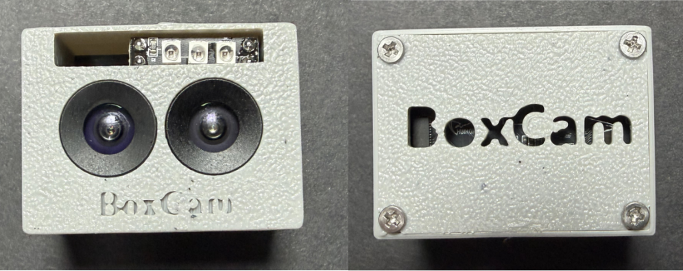

<div align="right">
  <strong>中文</strong> | <a href="README.md">English</a>
</div>

# BoxCam_AN SDK



主动近场感知机：主动红外+RGB 可夜视 双目  
Active Near-Field Perception Camera

适用于机器人腕部相机应用场景。

## 安装

```bash
pip install .
```

## 快速开始

### 方式一：直接运行（显示窗口）

安装后可以直接通过命令行运行，显示三个图像的窗口：

```bash
boxcam-an
```

或者：

```bash
python -m boxcam_an.boxcam
```

这将自动检测相机并显示一个窗口，包含三个图像（从左到右）：
1. Gray Image - RGB相机灰度图
2. RGB Image - RGB相机彩色图
3. Near_Field - 近场感知图（基于红外相机）

**控制说明：**
- 按 'q' 键：退出
- 按 'w' 键：增加最小近场感知范围
- 按 's' 键：减少最小近场感知范围
- 按 '+' 键：增加最大近场感知范围
- 按 '-' 键：减少最大近场感知范围
- 按 'f' 键：切换双边滤波
- 按 'a' 键：切换自适应归一化


### 方式二：读取三个图像的例程（显示窗口）

```python
from boxcam_an import BoxCam_AN
import cv2
import numpy as np

# 创建并初始化相机
boxcam_an = BoxCam_AN(auto_detect=True)
boxcam_an.initialize(rgb_width=640, rgb_height=480)

# 创建显示窗口
cv2.namedWindow('BoxCam_AN - 三视图', cv2.WINDOW_NORMAL)

try:
    while True:
        # 获取RGB和红外图像
        rgb_frame, _ = boxcam_an.rgb_camera.get_latest_frame()
        ir_frame, _ = boxcam_an.infrared_camera.get_latest_frame()
        
        if rgb_frame is None or ir_frame is None:
            continue
        
        # 转换为RGB灰度图
        if len(rgb_frame.shape) == 3:
            rgb_gray = cv2.cvtColor(rgb_frame, cv2.COLOR_BGR2GRAY)
        else:
            rgb_gray = rgb_frame.copy()
        
        # 转换为红外灰度图
        if len(ir_frame.shape) == 3:
            ir_gray = cv2.cvtColor(ir_frame, cv2.COLOR_BGR2GRAY)
        else:
            ir_gray = ir_frame.copy()
        
        # 计算近场感知图
        depth_map = boxcam_an.depth_estimator.estimate_depth(ir_gray)
        near_field = boxcam_an.depth_estimator.depth_to_colored(depth_map)
        
        # 转换为BGR格式用于显示
        rgb_gray_bgr = cv2.cvtColor(rgb_gray, cv2.COLOR_GRAY2BGR) if len(rgb_gray.shape) == 2 else rgb_gray
        
        # 统一高度并水平拼接
        target_height = min(rgb_gray_bgr.shape[0], rgb_frame.shape[0], near_field.shape[0])
        
        def resize_keep_aspect(image, target_h):
            h, w = image.shape[:2]
            scale = target_h / h
            new_w = int(w * scale)
            return cv2.resize(image, (new_w, target_h))
        
        gray_resized = resize_keep_aspect(rgb_gray_bgr, target_height)
        rgb_resized = resize_keep_aspect(rgb_frame, target_height)
        near_field_resized = resize_keep_aspect(near_field, target_height)
        
        # 水平拼接三个图像
        combined = np.hstack([gray_resized, rgb_resized, near_field_resized])
        
        # 显示图像
        cv2.imshow('BoxCam_AN - 三视图', combined)
        
        # 按 'q' 退出
        if cv2.waitKey(1) & 0xFF == ord('q'):
            break
            
except KeyboardInterrupt:
    print("\n用户中断")
finally:
    boxcam_an.stop()
    cv2.destroyAllWindows()
```

### 方式三：编程方式获取图像（不显示窗口）

```python
from boxcam_an import BoxCam_AN
import cv2

# 创建并初始化相机
boxcam_an = BoxCam_AN(auto_detect=True)
boxcam_an.initialize(rgb_width=640, rgb_height=480)

# 获取RGB和红外图像
rgb_frame, _ = boxcam_an.rgb_camera.get_latest_frame()
ir_frame, _ = boxcam_an.infrared_camera.get_latest_frame()

# 计算近场感知图
ir_gray = cv2.cvtColor(ir_frame, cv2.COLOR_BGR2GRAY) if len(ir_frame.shape) == 3 else ir_frame
depth_map = boxcam_an.depth_estimator.estimate_depth(ir_gray)
near_field = boxcam_an.depth_estimator.depth_to_colored(depth_map)

# 现在您有了三个图像：
# - rgb_frame: RGB彩色图 (BGR格式)
# - rgb_gray: RGB灰度图
# - near_field: 近场感知图 (BGR格式)

boxcam_an.stop()
```

## 示例代码

查看 `example/` 目录获取完整示例：
- `basic_usage.py` - 基础使用示例（读取三个图像）
- `robot_wrist_camera.py` - 机器人腕部相机封装示例

## 功能特性

- RGB + 红外双相机捕获
- 基于逆平方定律的近场感知
- 跨平台支持（Linux/Windows/macOS）
- 自动断线重连和错误处理
- 完善的图像验证机制

## 依赖

- Python >= 3.7
- opencv-python >= 4.5.0
- numpy >= 1.19.0
